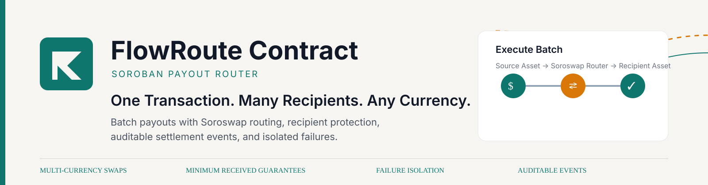

# flowroute-contract

flowroute-contract is the Soroban smart contract layer for FlowRoute, a payout tool for businesses that need to send money to many people at once, where each recipient may want a different currency. This contract swaps the source asset into each recipient's chosen destination asset through the Soroswap Router, enforces a per-recipient minimum-received floor on-chain, emits an auditable event per payout, and continues past any single recipient's failure without aborting the batch. The application layer that calls this contract lives in the sibling repo, flowroute-app.

**Documentation:** https://hollujay-labs.gitbook.io/flowroute/

[](https://github.com/Stellar-flowroute/flowroute-contract/actions/workflows/ci.yml)
[](https://developers.stellar.org/docs/learn/fundamentals/networks)

## Quick Start

Requirements: the Stellar CLI (`stellar`) and a Rust nightly toolchain with the `wasm32v1-none` target. The toolchain is pinned in `rust-toolchain.toml`.

Build the contract wasm:

```bash
stellar contract build
```

Run the test suite:

```bash
cargo test
```

Deploy to testnet. `test-deployer` is a locally configured identity that signs and pays for the transactions:

```bash
stellar contract deploy \
  --wasm target/wasm32v1-none/release/flowroute_router.wasm \
  --source test-deployer \
  --network testnet \
  --alias flowroute-router
```

Initialize the newly deployed FlowRoute Router with the admin address and the
external Soroswap Router address for testnet (use the contract id printed by
deploy, or the `flowroute-router` alias):

```bash
stellar contract invoke \
  --id flowroute-router \
  --source test-deployer \
  --network testnet \
  -- initialize \
  --admin <ADMIN_ADDRESS> \
  --swap_router CCJUD55AG6W5HAI5LRVNKAE5WDP5XGZBUDS5WNTIVDU7O264UZZE7BRD
```

The initializer must authorize as the supplied admin: `test-deployer` must be
that address or one of its signers. The external Soroswap Router address is a
testnet-specific deployment dependency; supply the appropriate verified venue
address when deploying to another network.

This API change requires a fresh FlowRoute Router deployment. The existing
testnet FlowRoute Router listed below was initialized with the prior interface
and is not changed by this release.

## Key Features

- **Batched payouts.** One transaction funds up to `MAX_BATCH_RECIPIENTS` recipients (see [Batch size limit](#batch-size-limit)). The full source amount is pulled from the sender once and distributed in the same call.
- **Multi-currency delivery.** Each recipient names a destination asset, and the router converts the source asset through the Soroswap Router.
- **On-chain slippage floor.** Every recipient must set a positive minimum received amount (`dest_min`); `execute_batch` rejects a zero or negative floor with `Error::InvalidAmount` before pulling the sender's total, because a zero floor would leave the recipient with no protection at all. FlowRoute measures the per-swap balance delta itself: an under-floor venue response returns `VenueUnderDelivered` and aborts the batch with an atomic rollback, so no partial payout or destination output is retained by the contract.
- **Auditable settlement.** Each payout run and every per-recipient result is emitted as an on-chain event, and a payout counter records how many runs have executed.
- **Failure isolation.** One recipient failing never aborts the batch. A swap that reverts is refunded to the sender at the end of the run.
- **Authorized venue pull.** The Soroswap Router moves the source tokens itself, from FlowRoute into the pair for the recipient's asset pair. FlowRoute resolves that pair from the venue and authorizes exactly that transfer, for that recipient's allocation, before the venue runs, so a real payout settles instead of silently refunding.
- **Pause switch.** The admin can pause execution between runs.

## Architecture

The router is a single Soroban contract in `contracts/router`. Storage holds the admin address, an immutable external Soroswap Router address, a paused flag, and a payout counter. Swaps are delegated to that configured venue. The public surface is four functions:

- `initialize(admin, swap_router)` sets the admin and immutable Soroswap Router venue, clears the paused flag, and resets the payout counter. It requires authorization from the supplied admin.
- `set_paused(paused)` pauses or unpauses the batch executor. Requires admin auth.
- `get_payout_count()` returns the number of payout runs executed so far.
- `execute_batch(sender, source_asset, recipients, total_source_amount)` executes one payout run. It validates the batch before moving any funds, rejecting a batch larger than `MAX_BATCH_RECIPIENTS` and any recipient whose allocation or `dest_min` is not positive, then pulls the total amount from the sender, swaps each recipient's allocation on the venue with the recipient's `dest_min` enforced as the output floor, emits per-recipient and per-run events, refunds failed swaps to the sender, and never aborts on a single failure.

### Venue fund flow and authorization

The configured Soroswap Router requires auth from `to` and then transfers the input tokens out of `to` and into the first pair of the swap path. FlowRoute therefore passes itself as `to` and has to authorize that transfer, because its invoker is the router rather than FlowRoute itself, so the usual rule that lets a contract move its own tokens does not apply.

For each recipient, `execute_batch`:

1. asks the venue for the pair it will transfer into (`router_pair_for`, the same resolution the router performs internally before its transfer: a salt over the sorted token pair, deployed from the venue's factory),
2. declares that exact transfer as an authorized invocation of this contract, naming the source token, `transfer`, this contract as `from`, the resolved pair as `to`, and the recipient's `amount_in`, and
3. calls the venue, which pulls the allocation into the pair, gets the output delivered to this contract, and is checked here against the recipient's `dest_min` using this contract's own balance delta.

A resolution is reused within a run when several recipients share a destination asset. Authorization is never blanket: the declared invocation is matched once, for that amount and that pair, so a venue that pulls into any other address is not authorized and fails closed, and the recipient is refunded like any other venue failure. Pairs are never hardcoded; a pair that cannot be resolved (a destination asset equal to the source asset, or an unreachable venue) fails that recipient and the rest of the batch continues.

The application layer lives in the sibling repository `flowroute-app`.

## Batch size limit

`execute_batch` accepts at most `MAX_BATCH_RECIPIENTS` recipients per call (6 as of this release). The limit is checked with the other batch guards, before the total is pulled from the sender, so an oversized batch reverts with `Error::TooManyRecipients` (code 10) and the sender's funds are never touched. Longer payout runs must be split into several calls.

The number is measured, not picked: one recipient costs the FlowRoute `payout` event plus the events that recipient's token transfers and swap emit, and a Stellar transaction may emit at most 16,384 bytes of contract events (`tx_max_contract_events_size_bytes`). That event budget, not CPU or memory, is what bounds the batch.

Calibration, run with the network transaction limits enforced (the default in the Soroban test environment, so an oversized batch fails during the test rather than silently passing). Each row uses a venue that reproduces the verified Soroswap router and pair event output for a single-hop swap:

| Recipients | Contract events (bytes) | Share of the event budget | Result |
| --- | --- | --- | --- |
| 1 | 2,208 | 13% | ok |
| 6 (`MAX_BATCH_RECIPIENTS`) | 11,228 | 69% | ok |
| 7 | 13,032 | 80% | ok |
| 8 | 14,836 | 91% | ok |
| 9 | 16,640 | 102% | rejected: `contract events size bytes: 16640 > 16384` |
| 10 | 18,444 | 113% | rejected |
| 12 | 22,052 | 135% | rejected |
| 16 | 29,268 | 179% | rejected |

Every other resource stays far inside its own limit. Re-measured after the venue-pull authorization was added, the envelope at the enforced maximum is 4,969,257 CPU instructions (1.2% of 400,000,000), 662,464 bytes of memory (1.6% of 41,943,040), 33 ledger entries read or written (8% of 400) and 2,864 bytes written to the ledger (2.2% of 132,096). Nothing else comes close even at much larger sizes: repeated against a venue that mirrors the router's fund flow but publishes none of the router's or pair's events, the event budget is exhausted at 17 recipients (`17200 > 16384`), and the next constraint behind it, the 400-entry footprint cap, is not reached until roughly 94 recipients. The authorization work did not move this: it adds one pair resolution per distinct destination asset per run and one 64-byte-argument authorization per recipient, no events, so the ceiling the event budget sets is unchanged.

The event footprint is exactly linear in the recipient count, 404 bytes of fixed cost (the batch event plus the single source transfer) plus 1,804 bytes per recipient, so the ceiling can be re-derived from smaller measurements. `batch_resource_envelope_reproduces_calibrated_ceiling` in `contracts/router/src/test.rs` re-measures the envelope at 1 and 6 recipients, checks every dimension against the network limits, and fails if the derived ceiling is no longer 8, so the maximum cannot drift above a changed event footprint unnoticed. The rows above the enforced maximum come from a sweep run before the limit was added; the committed test re-derives the ceiling from measurements the guard still allows.

One measurement caveat, so the envelope above is not read as more than it is. The calibration venue pulls the allocation into the pair and then delivers the output itself, instead of invoking the pair, because the Soroban test environment meters a fixed internal budget per contract invocation (a test-only guard on its authorization instrumentation) that the largest sweeps would otherwise exceed before the event budget could be observed. Measured at small sizes, invoking the pair adds about 105,000 CPU instructions and up to two ledger entries per recipient, so a fully pair-driven run at the maximum would be roughly 5.6M instructions (1.4%) and about 40 entries (10%) - still far inside every limit, and with byte-for-byte identical events, which is the dimension that bounds the batch.

Re-run the calibration:

```bash
cargo test --lib batch_resource_envelope -- --nocapture
```

## Existing contract addresses (testnet)

| Contract | Address |
| --- | --- |
| FlowRoute Router (prior interface) | `CBDWWJOW25KPUID432RZXFIPLHRYZY5KIXBT7FMC2L6LHFOITBMUX5LE` |
| External Soroswap Router | `CCJUD55AG6W5HAI5LRVNKAE5WDP5XGZBUDS5WNTIVDU7O264UZZE7BRD` |

## Contributing

See [CONTRIBUTING.md](CONTRIBUTING.md) for the development workflow, commit conventions, and how to open a pull request.

## Maintainers

| Maintainer | Contact |
| --- | --- |
| Hollujay | [GitHub](https://github.com/Hollujay) |
